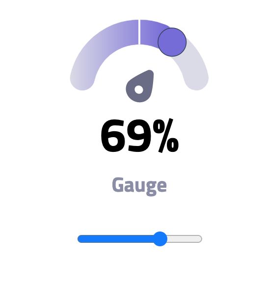

<h1 align="center">React Gauge</h1>

<div align="center">
  <h3>
    <a href="https://anthonydecuyper.netlify.app/">
      Demo
    </a>
  </h3>
</div>


## Table of Contents

- [Overview](#overview)
  - [Built With](#built-with)
- [Features](#features)
- [How to use](#how-to-use)
- [Contact](#contact)
- [Acknowledgements](#acknowledgements)

## Overview



### Built With

- [React](https://reactjs.org/)


## How To Use


To clone and run this application, you'll need [Git](https://git-scm.com) and [Node.js](https://nodejs.org/en/download/) (which comes with [npm](http://npmjs.com)) installed on your computer. From your command line:

```bash
# Clone this repository
$ git clone git@github.com:decuyperanthony/react-gauge-component.git

# Install dependencies
$ yarn

# Run the app
$ yarn start
```

## Usage
```jsx
import React from 'react';
import Gauge from './Gauge';

const App = () => {
  return (
      <Gauge
        value={50}
        min={0}
        max={100}
        label="Gauge"
        colorStartScale="#dbdbe7"
        colorEndScale="#4834d4"
      />
  )
};

export default App;
```
## Props
|Prop name        |Type          |value     |Default            |Description
|-----------------|------------|-------|-------------------|--------------------------------
|value         | `number`    |    | `50`  | Value of the Gauge
|min         | `number`    |   | `0`  | min of the Gauge
|value         | `number`    |     | `100`  | max of the Gauge
|label         | `string`    |     | `Gauge`  | label under the Gauge
|colorStartScale         | `string`    |     | `#dbdbe7`  | start linear gradient color
|label         | `string`    |     | `#4834d4`  | end linear gradient


## Acknowledgements

<!-- This section should list any articles or add-ons/plugins that helps you to complete the project. This is optional but it will help you in the future. For example: -->

- [Steps to replicate a design with only HTML and CSS](https://devchallenges-blogs.web.app/how-to-replicate-design/)
- [Node.js](https://nodejs.org/)
- [Marked - a markdown parser](https://github.com/chjj/marked)

## Contact

- Website [www.anthonydecuyper.fr](https://anthonydecuyper.netlify.app/)
- GitHub [@decuyperanthony](https://github.com/decuyperanthony)